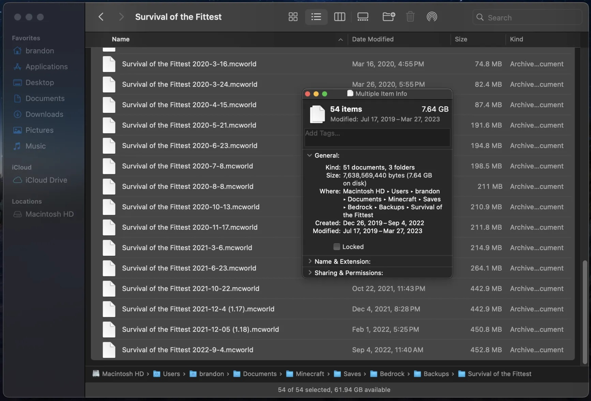

# Concepts

I initially wrote all of this out in Discord, so I'm essentially just cross-referencing the information I wrote from there. This all came about yesterday morning, randomly. I've initially throught about trying to save my existing `.mcworld` and `.zip` file backups of my Minecraft worlds in Git, but that isn't nicely diffable, easy to discern, nor provides any benefits over simple single-file `.mcworld` and `.zip` backups, because the edits can be diffed between world saves. It 'works', putting them into Git, but it doesn't have any new potential, unlike what Git provides to other diffable content types you put into it.

## Day One

Woah, crazy shower thought!!

Making a MC platform-independent world format which is Git-friendly (diffable, and easy tracked across edits, rather than big unnamed binary file diffs), where each backup of a world is added to a Git repo which holds all of the versions of a world, and each commit of those versions is dated to when the backup was

This is simply only for archival management purposes, it ideally would help with compression sizes since only the changes would be tracked, rather than another whole copy of the world (kind of like `.zip` vs `.tar.gz` in terms of the compression management, but more compact than that even because of said diff handling)

It started with an idea that it may be very helpful and useful to make a custom binary format to manage use of Bedrock's LevelDB abstraction, in that we could make a literal Anvil layer on top of Bedrock's database API, hence allowing for these optimizations to scale across world versions

I also already came up with the gimmickey file extension `.mcarchive`, if that's not already a thing 😂

Another thing to note: this wouldn't be a universal format in terms of NBT structs and block IDs, it would be platform-specific, with values unique to that version which it is derived from
The platform-independent part is that any of the MC platforms themselves could save to something like this

And yeah this is outside of the conversion step, it's just like how NBT is exactly the same as SNBT, in terms of one correlates exactly to the other with no data changes or loss

Say if you backup your world, and you only change blocks in a few spots, and explore new chunks, you'd get additions to the region/chunk files that hold that data, and you'd only get a diff in NBT chunk timestamps for existing chunks, entity movement, dates, blocks edited, not the entire chunk

This is the kind of thing I'd be curious about for large worlds
At most my solo survival world is about 450 MB, but the whole world tracked over time across it's backup versions is 7.64 GB

I guess that's not too bad of a size either tbh, but it's not very manageable in terms of it being to go through
It would be great to go through to see what each one changed, maybe also have a map that shows that chunks changed from the previous 'commit', like with a world map, see what new chunks there are, what entities died 😂 (especially since Bedrock has been know to just delete entities on chunk borders and such)

Another goofy extension name that's kind of clever could be `.mctangible` 😝

"An archive-friendly format to represent a Minecraft world's backups over time" *(Ended up using that as the description :) )*

> *Point made by PhoenixARC:*
> interesting idea, but mobs might cause issues, considering they're constantly despawning/respawning during play and each one has it's own UEID
> 
> could probably do a whitelist for non-mob/animal entities though so paintings and such are leftover while the rest get culled

*my discussion continuing on that*
How does Bedrock's DB packing/repacking work, if you guys happen to know? I think if it were to follow something like that, it may make sense
Something also along the lines of `git gc`, but for managing frequently changing MC data using this format of ours

I'm trying to figure out how to articulate what I mean by that

Like the stale data doesn't necessarily have to cause too many diffs, it can just be removed as needed later on or something

Aah! That might be it actually
Not sure how I feel about that in terms of Git tracking though

Say if a mob died in your world, it would 'stay' in the archive to be marked as deleted, and if you did `mcarchive gc`, it would only be deleted then

Seems a bit much just for diffing that out though

*the main part I did want to take away from this point, the rest of my idea I don't really like now. Git should be Git, it shouldn't leave changes in the source version control, getting rid of diffs for the sake of it seems to be the wrong idea*
Maybe we could also group things together in some regard, in the sense of like how Java split apart entity storage from MCA world data, we could do that also, so only the entity data of the chunk would change, but the block part of the archive doesn't need to have a diff too

### Reflection to that previous point (this is a revisit, on Day Two 👋)

So I think the goal is to allow the world data to be as version control applicable as possible, and if in the end, for a specfic dataset, it makes sense to instead continue to use blind commit diffs, then I think that's ok. The main concept is the diff of the data that you want to be able to ascertain.

So I think the `gc`-like behavior of managing frequently changing data isn't the problem of the diff system, that's a matter of how to abstract out the format as to be visibly changeable. I think storing entities in a separate file to their chunk counterparts is a nice move, as well as pets or other persistent entities into their own diffable files as well. So I think the concept is to organize what game features should be tracked specifically, versus being embedded into another game structure.

## Day Two

New name ideas:
`.mcbundle` (meh)
`.mcgit` 😂
`.mcversioncontrol` (no)
`.mcdonalds` (why am I pronouncing these like 'Mc' haha)
I think I still like `.mcarchive` the best, since it's like `.mcpack`, `.mcworld`, and all of the other ones (documented here 😃; <https://learn.microsoft.com/en-us/minecraft/creator/documents/minecraftfileextensions>)

Maybe it shouldn't use the `.mc*` prefix though, that could cause overlap issues in the future either for this project, if Mojang ends up using that feature, or say if hypothetically our concept goes bigger in the community, then it would block Mojang from being able to use the name because we already made it used commonplace
I think it's not too big of a thing to worry about, I kind of like that name too, so maybe it's worth it
It can always be gone backwards too, say if Mojang ends up using `.mcarchive` down the road, we can just choose a different name down the road

Interestingly, `.mcmeta` is listed in that link, but not `.mca` or `.mcr`, because come to think of it, I hadn't realized those follow that naming format too! Interesting, hadn't thought about it!

Also, why does `.mcmeta` really exist? Why not just use `.json`, Bedrock ended up taking that route, so Mojang contradicts themselves there too, whatever reason it may be behind using `.mcmeta`

It would've been neat had the Minecraft file structure formatting all been of a single thing, `.mca`, `.mcmeta`, `.mcworld`, `.mcpack`, rather than each platform using parts of those on their own 😢

Same with why it's not `.mcregion` or `.mcanvil`
Or `.mcchunk` in Alpha days 
Or `.mcnbt` if it were to be pedantic

### (Continuing from the reflection at the end of Day One):

Say if you have 1000 pigs that move around in one Region, the Chunks in the whole Region are going to diff out like crazy when you rearchive the world again, even though the blocks for each Chunk possibly didn't change *at all*. I'd rather the Chunk be shown as unchanged, and only have the entities change. Should each entity have it's own diff file entry, kind of like how Bedrock's LevelDB entries are stored Chunk(and region)-agnostically? That's the kind of thing I want to implement to more properly track the diff states in world data. If you specifically track individual features, outside of their containing formats (entities in a chunk, chunks in a region), then there's less of a surface to diff, making it easier to discern simple things as to what changed between the backup.

I kind of do like the idea for this. Maybe 'common' entities can be stored by Region essentially, and things can be tracked that way, allowing for a small diff surface, since those tend to change a lot, in terms of things like coordinates, health, hunger. Then things like bosses, players, pets, (leveled-up?) villagers, tamed horses, saddled-pigs or striders, (hopper?) minecarts, boats(?), other things like that, will be stored in their own diff files, allowing for simple tracking over time, which can allow for simple checks to verify that your favorite cat still exists in your latest backup. Some of my mobs dissapeared when opening/saving my Bedrock solo world, hence where my farms silently broke because my Hopper Minecarts despawned on Chunk borders. It was an annoying bug, and I had to use an NBT editor to re-add the entity to my world, since it was hard to get to in my world on it's own. It happened a few times over, so I didn't want to just keep using Iron to recraft the Minecarts every time. I was over wasting resources to couterract a bug that was plaguing me!!! aagh.